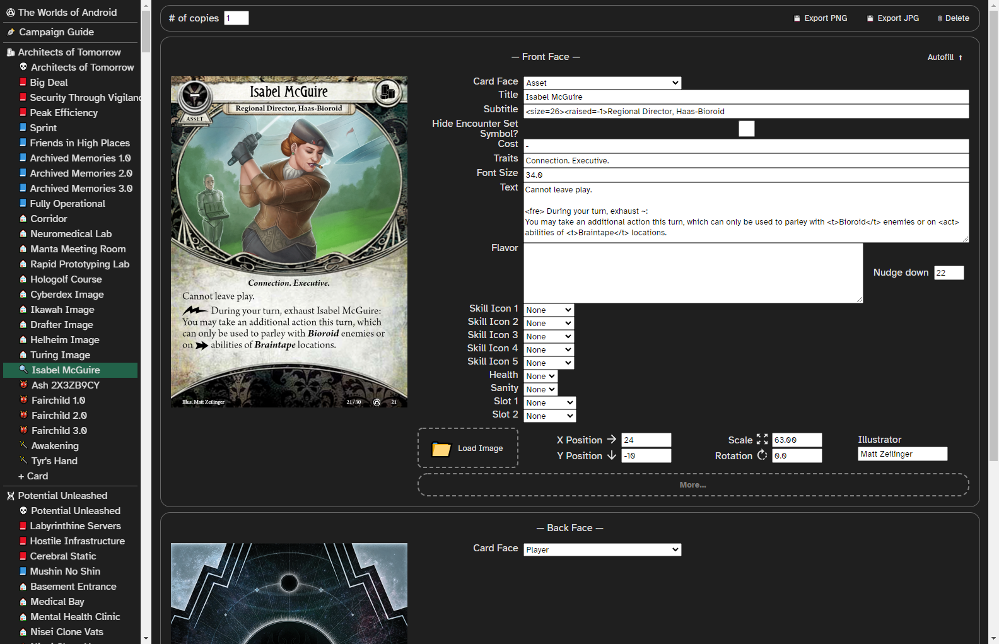

# Card Cultist

Card Cultist is a desktop app for designing your own expansions for *Arkham Horror: The Card
Game*. You fill in forms; it renders finished, print-ready cards and campaign guide pages.



## Status

This is a working personal tool, not a product.

I built it to make a full fan expansion, and it did that. *The Worlds of Android* is 583 cards
across 23 encounter sets plus a 36-page campaign guide, all of it authored and exported with this
app. That was the goal, and the tool is shaped around it: built out for encounter and campaign
content, thin in the places I never needed (see [Rough edges](#rough-edges)).

It has never been published or packaged for anyone else, there is no installer, and I am not
actively maintaining it. If you want to use it, you will be running it from source. It is
genuinely usable — I used it for four years — but it will not hold your hand.

## What it does

**Structure.** A campaign holds card sets; a card set holds cards; each card has a front and a
back face. You pick each face's type from 38 of them — agendas, acts, locations, enemies,
treacheries, story assets, investigators and their weaknesses, the mythos card, chaos token
effects. Cards and sets reorder by drag and drop, and copy and paste between sets with Ctrl+C /
Ctrl+V.

**Editing.** Each face is a form with a live canvas preview beside it. Load an illustration and
place it with X/Y, scale and rotation, and credit the artist. Card text is written in a small
markup language: `<b>`, `<i>`, `<t>traits</t>`, `<color=…>`, `<size=…>`, forty-odd game symbol
tags — `<act>`, `<rea>`, `<fre>`, `<wil>`, `<sku>`, the seal tokens — and shorthands, so `<rev>`
expands to a bolded **Revelation –**.

**Numbering.** Generate encounter set numbers across a set, respecting per-card copy counts, or
collector numbers across a whole campaign. Sort a set into canonical encounter order.

**Campaign guide.** A separate two-column page editor. Four page types — A4 and square, each with
a cover variant — and nine widget types: text, two header levels, illustrations, symbol rows,
resolution boxes, deco boxes, interlude boxes, and a contents page that draws its own dotted
leader lines.

**Export.** The deep part, because getting cards off the screen and onto card stock was the whole
point.

| Output | Detail |
| --- | --- |
| Single card | PNG or JPG |
| Whole set | PNG or JPG |
| With bleed | PNG, 3&nbsp;mm bleed at 300&nbsp;DPI, for printers like MakePlayingCards |
| Without bleed | PNG at native card size |
| Print-and-play PDF | A4 3×3 or US Letter 3×2, 300&nbsp;DPI, with crop marks |
| Tabletop Simulator | Deck sheet JPGs plus a TTS save-object JSON |
| Thumbnails | 160&nbsp;px JPGs cropped to the card art |
| Campaign guide | PDF, per page |

Everything lands in an `Exports/` folder beside your campaign file. There is also a campaign-wide
export page that batch-runs all of it across every set at once.

**Saving.** One JSON file per campaign, with a `.cardcultist` extension. Ctrl+S to save,
Ctrl+Shift+S to save as. The app reopens your last campaign on launch.

## Running it

Verified from a clean clone on Windows, July 2026.

### 1. Install the fonts

**Do this first — the app will not render cards correctly without it.** Card Cultist asks the
operating system for its fonts by name; it does not load them itself. Install all ten files from
[`public/fonts/`](public/fonts) into your system fonts (on Windows: select all, right-click,
*Install*). That gives you `Arno Pro`, `Teutonic`, `AHCardTextSymbols` and `Atkinson Hyperlegible`.

Skip this step and cards render in a fallback font, with the symbol tags coming out as stray
letters.

### 2. Use Node 16

Not optional. The build is webpack 4 era, and on any modern Node it dies with
`error:0308010C:digital envelope routines::unsupported`. There is an `.nvmrc`:

```bash
nvm use 16
```

### 3. Install

```bash
npm install
```

### 4. Run

The app runs as two processes: a Razzle dev server, and an Electron shell pointed at it. You need
both, in separate terminals. First:

```bash
npm run razzle-start
```

Wait for it to finish compiling — the first build takes a few minutes. Then, in a second
terminal:

```bash
npm start
```

Maximise the window. The campaign guide editor in particular needs the width and lays out badly
at the default window size.

### Building a distributable

`npm run make` is configured and it completes, producing a Squirrel installer for Windows in
`out/make/` (about 25 minutes; the installer is ~146&nbsp;MB).

**The result does not work as a standalone app.** `src/main.js` loads `http://localhost:3000`
unconditionally — the line that would load a production bundle instead is commented out directly
below it — and no production bundle is packaged, so the installed app opens a window pointing at
a dev server that will not be running on anyone else's machine. Two related things: the package
has no `ignore` config, so it ships the entire dev toolchain (44,000 of its 45,000 files are
`node_modules`), and `npm run build` is never wired into the packaging step. Turning this into a
real binary is a small change I simply never made, because I only ever ran it from source.

## How it's built

React 17 behind [Razzle](https://razzlejs.com/) in SPA mode (Express underneath), wrapped in
Electron via electron-forge. The interface is hand-written SCSS rather than a component library —
MUI is in the tree but only supplies a handful of icons — with dnd-kit for drag-and-drop
reordering and jsPDF for PDF output. All file access goes through a preload bridge, so the
renderer never touches `fs` directly. Card faces are late-bound — a type string in the saved JSON
resolves to a class at runtime — so adding a card type meant dropping in a directory and adding
one line to a list, which is why there are 38 of them.

The part worth a look is the text engine in
[`src/helpers/canvasTextWriter/`](src/helpers/canvasTextWriter). Card text is parsed into atoms —
words, spaces, symbols, formatting instructions — and typeset onto the canvas by hand. The useful
trick is that a text box's left edge and width are not constants but **functions of vertical
offset**: `CanvasTextConfig` normalises both to `(dy) => number`, so an enemy card can declare
`.withX((dy) => Math.max(38, 90 - 4 * dy, 1.05 * dy - 134))` and have its text flow correctly
inside the curved, non-rectangular text area of the printed frame. Rectangular text boxes would
have been far less work and would have looked obviously wrong on half the card types.

## Rough edges

Known and unfixed, roughly in order of how likely you are to hit them.

- **Class-coloured player cards are mostly unimplemented.** Assets are hard-wired to the
  encounter/story frame — there is no class picker — and of the event frames only neutral and
  weakness are wired up. **There is no Skill card type at all.** The unused frames are sitting in
  `public/templates/` with nothing importing them. This is the "thin where I didn't need it"
  part: I was building a campaign, not a player-card set.
- **"Export entire campaign guide as PDF" exports only the current page**, because only one page
  is ever in the DOM. Per-page export works correctly.
- **Deleting the last page of a campaign guide crashes the app.**
- The two neutral investigator faces are missing from the encounter-ordering list, so sorting a
  set pushes them to the end.
- Export readiness is detected by polling canvases for a non-transparent pixel in their top-left
  corner, so it can occasionally fire before rendering has finished.
- "Reopen last campaign" resolves its path relative to the working directory, so it only works
  when the app is launched from the project folder.
- One test, `renders without exploding`. It passes.
- The dependency tree is from 2022 and `npm audit` is loud about it. It's a local-only desktop
  tool with no network surface, and updating Razzle 4 and webpack 4 was never worth the afternoon.

## Legal

**This is an unofficial fan project. It is not affiliated with, endorsed, sponsored or approved
by Fantasy Flight Games.** *Arkham Horror: The Card Game* is a trademark of Fantasy Flight Games.

So that the app can produce cards matching the printed game, this repository includes card frame
images, encounter set symbols and fonts belonging to Fantasy Flight Games and other rights
holders. **Those assets are not mine and are not covered by this repository's licence.** They are
here so the tool functions; they are not offered for reuse. Specifically: everything under
`public/templates/`, `public/overlays/` and `public/icons/`, and the Arno Pro and Teutonic fonts
under `public/fonts/`. (Atkinson Hyperlegible is separately licensed under the SIL Open Font
License by the Braille Institute.)

The MIT licence in [LICENSE](LICENSE) covers the source code in `src/` only.

Cards you make with this are your own business. Don't sell them.
